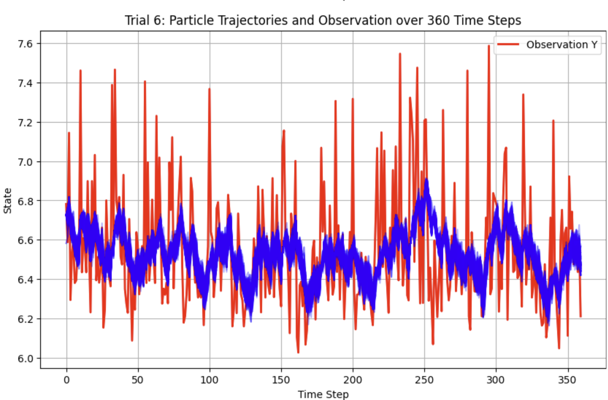
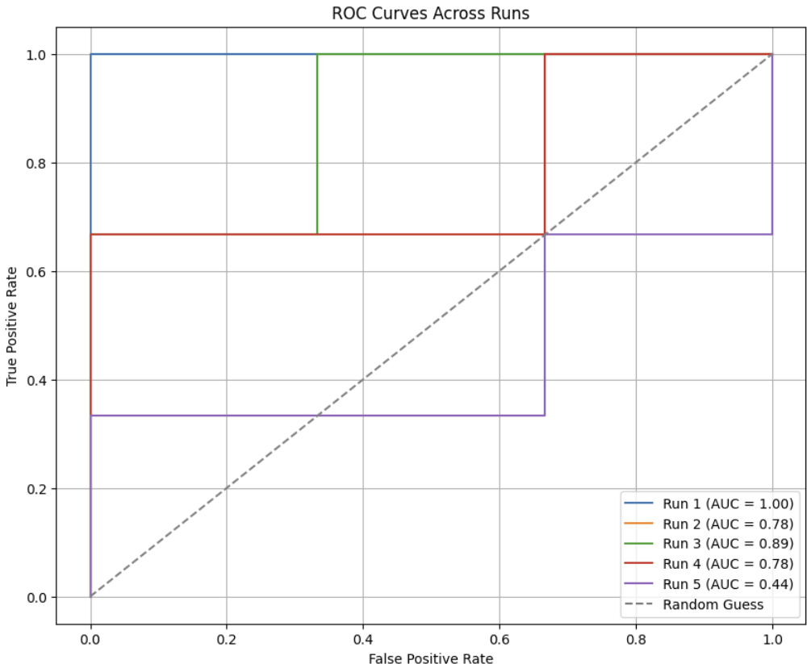

# JAX-based implementation of structured state-space models combined with deep neural networks for scalable and interpretable time-series modeling
## Introduction

A fast, differentiable implementation of State-Space Models combined with Deep Neural Networks (SSM-DNN) using [JAX](https://github.com/jax-ml/jax) for accelerated and scalable computation.

This repository extends the original [SSM-DNN](https://github.com/Pedram-Rajaei/SSM-DNN) implementation by leveraging JAX's high-performance automatic differentiation and parallelization capabilities. The resulting framework supports efficient training and inference for high-dimensional, temporally structured data.

---

## What's New in SSM-DNN-JAX?

- **JAX Backend**: Full rewrite of computational routines using JAX for GPU/TPU acceleration and vectorized operations.
- **Speed & Efficiency**: Up to **10× speed improvement** in training and inference compared to the NumPy-based implementation.
- **Clean Modular Design**: Reorganized code structure for easier experimentation and extension.
- **Expanded Functionality**:
  - EM + SMC particle-based inference
  - GP-based interpolation
  - Multivariate support

---

## Project Overview

State-Space Models (SSMs) are powerful tools for modeling **latent dynamics in time series**. By combining SSMs with **deep neural network encoders and decoders**, this framework learns both **interpretable latent dynamics** and **rich observation mappings**. For more details on the modular structure of this approach, please refer [here](https://github.com/Pedram-Rajaei/SSM-DNN/tree/main/Docs).

The JAX-based version maintains the original SSM-DNN architecture but improves:

- Execution speed (via `jit` compilation and `vmap`)
- Scalability to higher dimensions
- Differentiability of all components

---

<article>
  <section>
    <h3>Structure</h3>
    <pre><code>
SSM-DNN-JAX/
├── data/                 # Synthetic and real datasets
├── models/               # Core model definitions (SSM, RNN, CNN)
├── inference/            # EM algorithm, SMC filtering
├── utils/                # Helper functions
├── main.py               # Main training and evaluation script
└── README.md             # This file
    </code></pre>
  </section>

  <section>
    <h3>Installation</h3>
    <pre><code class="language-bash">
git clone https://github.com/Pedram-Rajaei/SSM-DNN-JAX.git
cd SSM-DNN-JAX
pip install -r requirements.txt
    </code></pre>
  </section>

  <section>
    <h3>Examples</h3>
    <pre><code class="language-bash">
# Run EM + SMC inference on synthetic dataset
python main.py --task synthetic --method smc_em
    </code></pre>
  </section>

  <section>
    <h3>Performance</h3>
    <ul>
      <li>🚀 Faster convergence in EM steps</li>
      <li>📈 Scalable inference for higher-dimensional systems</li>
      <li>⏱️ Support for real-time filtering and decoding</li>
    </ul>
  </section>

  <section>
    <h3>Applications</h3>
    <ul>
      <li>Neural decoding from calcium imaging data</li>
      <li>Behavioral time-series modeling</li>
      <li>Interpretable latent dynamics in physiological data</li>
      <li>Real-time inference for wearable sensor streams</li>
    </ul>
  </section>

  <section>
    <h3>Reference</h3>
    <p>
      If you use this code in your research, please consider citing the original <strong>SSM-DNN</strong> project and acknowledging the enhancements made here.
    </p>
  </section>

  <section>
    <h3>Acknowledgements</h3>
    <p>
      This project builds on the foundations of <strong>SSM-DNN</strong>, with thanks to the <strong>JAX</strong> and <strong>BlackJAX</strong> communities for creating tools that make high-performance Bayesian modeling accessible.
    </p>
  </section>
</article>


## Methodology

### 1. State-Space Model

The state-space model represents a dynamical system characterized by the equations:

**State transition equation:**

$$  x_{k} = A x_{k-1} + B + ε $$

where:
- `A` (`jnp.ndarray`, shape `(dim_state, dim_state)`) represents the transition matrix.
- `B` (`jnp.ndarray`, shape `(dim_state,)`) is an external control term.
- `ε` is process noise sampled from a Gaussian distribution with variance `Q` (`jnp.ndarray`, shape `(1,)`).

**Observation equation:**

$$ y_k = C x_k + D + ν $$

where:
- `C` (`jnp.ndarray`, shape `(dim_obs, dim_state)`) is the observation matrix.
- `D` (`jnp.ndarray`, shape `(dim_obs,)`) is an offset.
- `ν` is Gaussian observation noise with variance `R` (`jnp.ndarray`, shape `(1,)`).

#### Implementation
A `State` data class is used to efficiently represent system parameters, enabling flexible simulation of different dynamical behaviors.
```python
@dataclass
class State:
    A: jnp.ndarray           # (dim_state, dim_state)
    B: jnp.ndarray           # (dim_state,)
    C: jnp.ndarray           # (dim_obs, dim_state)
    D: jnp.ndarray           # (dim_obs,)
    Q: jnp.ndarray           # (1,)
    R: jnp.ndarray           # (1,)
    R0: jnp.ndarray          # (1,)
    dim_state: int           # e.g., 1
    initial_mean: jnp.ndarray  # (dim_state,)
```
**Example Usage:**
```python
state = State(A=jnp.eye(2), B=jnp.zeros(2), C=jnp.array([[1, 0]]), D=jnp.zeros(1), 
              Q=jnp.array([0.1]), R=jnp.array([0.1]), R0=jnp.array([1.0]), dim_state=2, 
              initial_mean=jnp.zeros(2))
```

### 2. FFT-based Particle Analysis

Before processing particles through the CNN, Fast Fourier Transform (FFT) is applied to capture frequency-domain characteristics. This allows the network to learn periodic structures in the data, which is useful for time-series classification.

#### Implementation
The FFT is computed using `jax.numpy.fft.fft`, and the resulting magnitude spectrum is normalized to reduce dominant DC components and compress the dynamic range.
```python
def apply_fft_to_dparticle(dparticle: jnp.ndarray) -> jnp.ndarray:
    """
    Applies Fast Fourier Transform (FFT) to the input particle data, 
    normalizes the transformed values, and returns the processed result.
    
    Args:
        dparticle (jnp.ndarray): Input time-series particle data.

    Returns:
        jnp.ndarray: Normalized FFT-transformed data.
    """
    fft_complex = jnp.fft.fft(dparticle, axis=0)  # Compute FFT
    fft_magnitude = jnp.abs(fft_complex)          # Compute magnitude
    fft_log = jnp.log1p(fft_magnitude)            # Log transformation
    mean_val = jnp.mean(fft_log)                  # Compute mean
    std_val = jnp.std(fft_log) + 1e-6             # Compute std dev (avoid div by zero)
    fft_norm = (fft_log - mean_val) / std_val     # Normalize
    return fft_norm
```
**Example Usage:**
```python
dparticle = jnp.array([0.1, 0.5, 0.3, 0.7, 1.0])
fft_transformed = apply_fft_to_dparticle(dparticle)
```

### 3. Sequential Monte Carlo (SMC) Updates

SMC employs particle filtering for estimating latent states. Systematic resampling is implemented using Blackjax.
If y > α, a Kalman filter-based update is applied, leveraging observed data for state estimation. However, if y < α, this indicates the presence of missing data points in the dataset. In such cases, continuing with the Kalman filter update is not appropriate. Instead, a standard Gaussian proposal is used to propagate the particles, ensuring robustness in the presence of incomplete observations. Keep in mind that the value of α is decided by the user. So we have:
- If `y > α`, a Kalman filter-based update is applied.
- Otherwise, a standard Gaussian proposal is used.

#### Implementation
The `proposal_fn` function generates new particle estimates based on the current state and observations.
```python
def proposal_fn(state: State, particle: jnp.ndarray, y: float, key) -> (jnp.ndarray, float):
    """
    Generates a new particle proposal based on the given state and observation.

    Args:
        state (State): The current system state.
        particle (jnp.ndarray): The particle to update.
        y (float): The observed value.
        key: PRNG key for random number generation.

    Returns:
        tuple: A new particle and its log weight.
    """
    moved = jnp.dot(state.A, particle) + state.B
    threshold = 6.0

    def above_threshold(_):
        return moved, state.Q

    def below_threshold(_):
        return moved, state.R * 1.1

    mean_q, sigma_q = jax.lax.cond(y > threshold, above_threshold, below_threshold, operand=None)
    new_particle = mean_q + jnp.sqrt(sigma_q) * jr.normal(key, shape=mean_q.shape)
    log_weight = -0.5 * (((new_particle - mean_q) ** 2) / sigma_q + jnp.log(2 * math.pi * sigma_q))

    return new_particle, log_weight
```
**Example Usage:**
```python
key = random.PRNGKey(0)
new_particle, log_weight = proposal_fn(state, jnp.array([0.5, 0.2]), y=0.8, key=key)
```

The `smc_update2` function performs the update step, adjusting particle weights.
```python

def smc_update2(state: State, particle: jnp.ndarray, y: float, key) -> (jnp.ndarray, jnp.ndarray):
    """
    Performs a single update step in the Sequential Monte Carlo (SMC) framework.

    Args:
        state (State): The current system state.
        particle (jnp.ndarray): The current particle representation.
        y (float): The observed measurement.
        key: PRNG key for random number generation.

    Returns:
        tuple: Updated particle and corresponding weight.
    """
    new_particle, weight = proposal_fn(state, particle, y, key)
    return new_particle, weight
```
**Example Usage:**
```python
new_particle, weight = smc_update2(state, jnp.array([0.5, 0.2]), y=0.8, key=key)
```

The `particle_filter_single_trial2` function runs a single trial particle filter.
```python
def particle_filter_single_trial2(key, state: State, observations: jnp.ndarray, num_particles: int) -> jnp.ndarray:
    """
    Runs a single trial of the particle filter for state estimation.

    Args:
        key: PRNG key for random number generation.
        state (State): The system state parameters.
        observations (jnp.ndarray): The observed data sequence (T,).
        num_particles (int): The number of particles used in the filter.

    Returns:
        jnp.ndarray: History of particle states across time steps.
    """
    T = observations.shape[0]

    # Initialize particles based on initial state mean and noise variance
    init_particles = state.initial_mean + jnp.sqrt(state.R0) * jr.normal(
        key, shape=(num_particles, state.dim_state)
    )

    def step_fn(carry, y):
        key, particles = carry
        key, subkey = jr.split(key)

        # Perform SMC update on each particle
        new_particles, weights = jax.vmap(lambda p, k: smc_update2(state, p, y, k))(
            particles, jr.split(subkey, particles.shape[0])
        )

        # Normalize weights
        norm_weights = weights / (jnp.sum(weights) + 1e-6)

        # Systematic resampling
        indices = systematic(subkey, norm_weights, num_particles)
        resampled_particles = new_particles[indices]

        return (key, resampled_particles), resampled_particles

    # Run the particle filter over time using JAX scan
    _, particles_history = jax.lax.scan(step_fn, (key, init_particles), observations)

    return particles_history
```
**Example Usage:**
```python
particles_history = particle_filter_single_trial2(key, state, jnp.array([1.0, 2.0, 3.0]), num_particles=100)
```

The `particle_filter_multi_trial2` function runs a particle filter across multiple trials.
```python
def particle_filter_multi_trial2(key, state: State, observations_all_trials: jnp.ndarray, num_particles: int) -> jnp.ndarray:
    """
    Runs a particle filter across multiple trials.

    Args:
        key: PRNG key for randomness.
        state (State): The system state parameters.
        observations_all_trials (jnp.ndarray): Observations for multiple trials (shape: num_trials, T, dim_obs).
        num_particles (int): The number of particles used in the filter.

    Returns:
        jnp.ndarray: Filtered particle states (shape: num_trials, T, num_particles, dim_state).
    """
    def filter_trial(key, obs):
        return particle_filter_single_trial2(key, state, obs, num_particles)

    # Generate a unique key for each trial
    keys = jr.split(key, observations_all_trials.shape[0])

    # Run the particle filter on each trial using jax.vmap for parallelization
    particles_trials = jax.vmap(filter_trial)(keys, observations_all_trials)

    return particles_trials  # Shape: (num_trials, T, num_particles, dim_state)
```

**Example Usage**
```python
particles_trials = particle_filter_multi_trial2(key, state, jnp.ones((5, 100, 1)), num_particles=200)
```
### 4. CNN-based Particle Resampling

A 1D CNN is implemented in JAX using the Flax framework. The CNN architecture includes:
- Two convolutional layers (kernel sizes: 10, 20) with batch normalization and Leaky ReLU activation.
- Pooling layers for dominant feature extraction.
- Fully connected layers for classification (binary: class 0 or 1).
- Dropout layers to prevent overfitting.

#### Implementation
The `CNN1D` model defines a 1D CNN for time-series classification.
```python
class CNN1D(nn.Module):
    """
    A 1D Convolutional Neural Network (CNN) for time-series classification.

    Args:
        input_channels (int): Number of input channels.
        input_time_steps (int): Number of time steps in the input sequence.
        dropout_rate (float): Dropout rate for regularization (default: 0.3).

    Methods:
        __call__(x, train=True): Forward pass through the CNN.

    Returns:
        jnp.ndarray: Output logits with shape (batch, 2).
    """
    input_channels: int
    input_time_steps: int
    dropout_rate: float = 0.3

    @nn.compact
    def __call__(self, x, train: bool = True):
        """
        Forward pass of the 1D CNN.

        Args:
            x (jnp.ndarray): Input tensor of shape (batch, time_steps, channels).
            train (bool): If True, applies dropout and batch normalization in training mode.

        Returns:
            jnp.ndarray: Output logits of shape (batch, 2).
        """
        # First convolutional block
        x = nn.Conv(features=8, kernel_size=(10,), padding='SAME')(x)
        x = nn.BatchNorm(use_running_average=not train)(x)
        x = nn.leaky_relu(x)
        x = nn.avg_pool(x, window_shape=(2,), strides=(2,))
        x = nn.Dropout(rate=self.dropout_rate, deterministic=not train)(x)

        # Second convolutional block
        x = nn.Conv(features=16, kernel_size=(20,), padding='SAME')(x)
        x = nn.BatchNorm(use_running_average=not train)(x)
        x = nn.leaky_relu(x)
        x = nn.avg_pool(x, window_shape=(2,), strides=(2,))
        x = nn.Dropout(rate=self.dropout_rate, deterministic=not train)(x)

        # Fully connected layers
        x = x.reshape((x.shape[0], -1))  # Flatten
        x = nn.Dense(features=64)(x)
        x = nn.leaky_relu(x)
        x = nn.Dropout(rate=self.dropout_rate, deterministic=not train)(x)

        # Output layer
        x = nn.Dense(features=2)(x)

        return x
```
**Example Usage:**
```python
cnn_model = CNN1D(input_channels=1, input_time_steps=100, dropout_rate=0.1)
```

The `cnn_apply_fn` function applies the CNN model.
```python
def cnn_apply_fn(variables, inputs, train, **kwargs):
    """
    Applies the CNN model to the given inputs.

    Args:
        variables: Model parameters and state.
        inputs (jnp.ndarray): Input tensor of shape (batch, time_steps, channels).
        train (bool): Whether the model is in training mode.
        **kwargs: Additional arguments for the model.

    Returns:
        jnp.ndarray: Output logits of shape (batch, 2).
    """
    return cnn_model.apply(variables, inputs, train=train, **kwargs)
```
**Example Usage:**
```python
logits = cnn_apply_fn(cnn_variables, jnp.ones((10, 100, 1)), train=True)
```
The `cnn_resample_particles` function refines particles using CNN-predicted weights.

```python
def cnn_resample_particles(all_particles, cnn_variables, cnn_apply_fn, trial_label, key):
    """
    Refines particles using CNN-predicted weights.

    Args:
        all_particles (jnp.ndarray): Particles to be resampled (shape: T, num_particles, dim_state).
        cnn_variables: CNN model parameters.
        cnn_apply_fn: Function to apply the CNN model.
        trial_label (int): The label of the trial used for selecting CNN output.
        key: PRNG key for randomness.

    Returns:
        jnp.ndarray: Resampled particles.
    """
    # Compute CNN-predicted weights using softmax
    weights_nn = jax.vmap(lambda i: jax.nn.softmax(
        cnn_apply_fn(cnn_variables, apply_fft_to_dparticle(all_particles[:, i, :])[:, None][None, :, :], train=False)
    )[0, trial_label])(jnp.arange(all_particles.shape[1]))

    # Perform systematic resampling based on normalized weights
    indices = systematic(
        jr.split(key)[0], weights_nn / (jnp.sum(weights_nn) + 1e-6), all_particles.shape[1]
    )

    # Add small Gaussian noise to prevent particle degeneracy
    return all_particles[:, indices, :] + jr.normal(
        jr.split(key)[1], shape=all_particles[:, indices, :].shape
    ) * 1e-5
```
**Example Usage:**
```python
resampled_particles = cnn_resample_particles(
    particles_trials, cnn_variables, cnn_apply_fn, 1, key
)
```

### 5. Expectation Maximization (M-Step)
In the Expectation-Maximization (EM) algorithm, the Maximization Step (M-Step) updates the parameters of the model to maximize the expected log-likelihood obtained in the Expectation Step (E-Step). Given the posterior probabilities of the latent variables (computed in the E-Step), the M-Step optimizes the model parameters by solving a maximization problem. This typically involves computing the maximum likelihood estimates (MLE) or maximum a posteriori (MAP) estimates of parameters such as means, variances, and mixture weights in Gaussian Mixture Models (GMMs). The updated parameters are then used in the next iteration of the E-Step, and the process continues until convergence.
#### Implementation
The `m_step` function updates the process noise variance (Q) based on particle filtering results.
```python
def m_step(state: State, particles_trials: jnp.ndarray, damping=0.1, eps=1e-6) -> State:
    """
    Updates the process noise variance (Q) based on particle filtering results.

    Args:
        state (State): The current system state.
        particles_trials (jnp.ndarray): The particles generated from multiple trials (shape: num_trials, T, num_particles, dim_state).
        damping (float): Damping factor to control the update rate (default: 0.1).
        eps (float): Small constant to prevent division by zero (default: 1e-6).

    Returns:
        State: Updated state with the new process noise variance (Q).
    """
    num_trials, T, num_particles, dim_state = particles_trials.shape

    # Extract consecutive time-step pairs
    x_t = particles_trials[:, :-1, :, :]
    x_tp1 = particles_trials[:, 1:, :, :]

    # Compute predicted next state based on transition matrix A and control B
    predicted = jnp.einsum('ij,btpj->btpi', state.A, x_t) + state.B

    # Compute squared prediction error
    error = x_tp1 - predicted
    squared_error = jnp.sum(error**2, axis=-1)

    # Compute new process noise variance (Q)
    new_Q = jnp.mean(squared_error)
    new_Q = jnp.maximum(new_Q, 1e-3)  # Ensure a minimum variance to avoid numerical issues

    # Apply damping to update Q
    updated_Q = damping * new_Q + (1 - damping) * state.Q[0]

    # Return updated state
    return State(A=state.A, B=state.B, C=state.C, D=state.D, 
                 Q=jnp.array([updated_Q]), R=state.R, R0=state.R0, 
                 dim_state=state.dim_state, initial_mean=state.initial_mean)
```
**Example Usage:**
```python
updated_state = m_step(state, particles_trials)
```
### 6. Expectation-Maximization (EM) Algorithm

The EM algorithm iteratively refines the state-space model parameters:
- **E-Step:** Running the particle filter, updating particle weights based on CNN classification.
- **M-Step:** Updating the process noise variance (`Q`) using observed particle variance.

#### Implementation
The `run_em` function runs the EM algorithm with CNN updates.
```python
def run_em(key, state: State, observations_all_trials: jnp.ndarray, num_particles: int,
           num_iters: int, cnn_variables, cnn_opt_state, cnn_apply_fn, optimizer, cnn_labels):
    """
    Runs the Expectation-Maximization (EM) algorithm for state-space model estimation.

    Steps:
      - E–Step: Particle filtering across trials.
      - Apply FFT on particles.
      - CNN-based resampling per trial using FFT-transformed particles.
      - M–Step: Update process noise variance (Q).
      - Update CNN parameters using the new (FFT-transformed) particles.

    Args:
        key: PRNG key for randomness.
        state (State): The current system state.
        observations_all_trials (jnp.ndarray): Observations for multiple trials.
        num_particles (int): Number of particles for SMC.
        num_iters (int): Number of EM iterations.
        cnn_variables: CNN model parameters.
        cnn_opt_state: CNN optimizer state.
        cnn_apply_fn: Function to apply CNN model.
        optimizer: CNN optimizer.
        cnn_labels: Labels for CNN classification.

    Returns:
        tuple: Updated state, log-likelihoods, final particle history, CNN parameters, and optimizer state.
    """
    log_likelihoods = []
    final_particles_history = None

    for i in range(num_iters):
        key, subkey = jr.split(key)

        # Run particle filtering across trials
        particles_trials = particle_filter_multi_trial2(subkey, state, observations_all_trials, num_particles)
        # particles_trials shape: (num_trials, T, num_particles, dim_state)

        # CNN-based resampling using FFT-transformed particles
        num_trials = particles_trials.shape[0]
        keys_for_cnn = jr.split(key, num_trials)

        def resample_trial(particles, label, key_):
            return cnn_resample_particles(particles, cnn_variables, cnn_apply_fn, label, key_)

        particles_resampled = jax.vmap(resample_trial)(particles_trials, cnn_labels, keys_for_cnn)
        final_particles_history = particles_resampled

        # M-Step: Update process noise variance (Q)
        state = m_step(state, particles_resampled, damping=0.1)

        # Compute prediction error
        x_t = particles_resampled[:, :-1, :, :]
        x_tp1 = particles_resampled[:, 1:, :, :]
        predicted = jnp.einsum('ij,btpj->btpi', state.A, x_t) + state.B
        error = x_tp1 - predicted
        squared_error = jnp.sum(error**2, axis=-1)

        # Compute likelihood
        score = 0.5 * jnp.mean(squared_error)
        likelihood = jnp.exp(-score)
        log_likelihoods.append(likelihood)

        print(f"Iteration {i+1}: Score = {score}, Likelihood = {likelihood}, Updated Q = {state.Q}")

        # Apply FFT on each particle trajectory along the time axis
        fft_particles = jax.vmap(
            lambda trial: jax.vmap(lambda particle: apply_fft_to_dparticle(particle))(trial)
        )(particles_trials)
        # fft_particles shape: (num_trials, T, num_particles, dim_state)

        # Update CNN parameters using FFT-transformed particles
        cnn_variables, cnn_opt_state = nn_step(
            fft_particles, cnn_labels, cnn_variables, cnn_opt_state, cnn_apply_fn, optimizer,
            batch_size=32, epochs=5
        )

    return state, jnp.array(log_likelihoods), final_particles_history, cnn_variables, cnn_opt_state
```
**Example Usage:**
```python
state, log_likelihoods, particles_history, cnn_variables, cnn_opt_state = run_em(
    key, state, jnp.ones((5, 100, 1)), 100, 10, cnn_variables, cnn_opt_state, 
    cnn_apply_fn, optimizer, cnn_labels)
```
### 7. Neural Network Training Step
In the Expectation-Maximization (EM) algorithm applied to training a Neural Network (NN), the E-Step generates particles (samples or weighted latent representations) that approximate the posterior distribution over latent variables. In the M-Step, these particles are used to update the neural network's parameters by optimizing the expected likelihood. Specifically, the network's weights and biases are adjusted using gradient-based optimization (e.g., Stochastic Gradient Descent) to maximize the expected log-likelihood given the sampled particles. This iterative process ensures that the neural network learns a better representation of the underlying data distribution at each iteration, improving model performance and convergence stability.
#### Implementation
The `nn_step` function updates CNN parameters based on new particles.
```python
def nn_step(all_particles, labels_train, cnn_variables, cnn_opt_state, cnn_apply_fn, optimizer, batch_size=32, epochs=5):
    """
    Updates CNN parameters based on new particles.

    Args:
        all_particles (jnp.ndarray): Particle trajectories across trials (shape: num_trials, T, num_particles, dim_state).
        labels_train (jnp.ndarray): Training labels corresponding to trials.
        cnn_variables: CNN model parameters.
        cnn_opt_state: CNN optimizer state.
        cnn_apply_fn: Function to apply the CNN model.
        optimizer: Optimizer for training.
        batch_size (int): Batch size for training (default: 32).
        epochs (int): Number of training epochs (default: 5).

    Returns:
        tuple: Updated CNN variables and optimizer state.
    """
    num_trials, T, num_particles, dim_state = all_particles.shape

    # Reshape particle data for CNN input
    x_temp = jnp.transpose(all_particles, (0, 2, 1, 3)).reshape(-1, T, dim_state)

    # Repeat labels to match particle count
    labels_repeated = jnp.repeat(labels_train, num_particles, axis=0)

    # Shuffle dataset
    dataset_size = x_temp.shape[0]
    permutation = jax.random.permutation(jr.PRNGKey(0), dataset_size)
    x_temp, labels_repeated = x_temp[permutation], labels_repeated[permutation]

    # Training loop
    for _ in range(epochs):
        for i in range(dataset_size // batch_size):
            cnn_variables, cnn_opt_state, _ = cnn_train_step(
                cnn_variables, cnn_opt_state,
                x_temp[i * batch_size:(i + 1) * batch_size],
                labels_repeated[i * batch_size:(i + 1) * batch_size],
                cnn_apply_fn, optimizer, jr.PRNGKey(1234)
            )

    return cnn_variables, cnn_opt_state
```
**Example Usage**
```python
cnn_variables, cnn_opt_state = nn_step(
    particles_trials, cnn_labels, cnn_variables, cnn_opt_state, cnn_apply_fn, optimizer
)
```
### 8. Cross-Validation and Evaluation

To ensure robustness, the model is evaluated using:
- **Dataset splitting:** Training and testing subsets (maintaining class balance).
- **Evaluation Metrics:** Receiver Operating Characteristic (ROC) curves, AUC scores.
- **Cross-validation:** Multiple training runs.

#### Implementation
The `evaluate_model_roc_curve` function evaluates CNN performance using ROC curves.
```python
def evaluate_model_roc_curve(cnn_variables, cnn_apply_fn, test_data, test_labels):
    """
    Evaluates the CNN model on the test set by applying the same FFT transformation
    (with log and normalization) that was used during training. The CNN then produces logits,
    from which the predicted probabilities and ROC curve are computed.

    Args:
        cnn_variables: CNN model parameters.
        cnn_apply_fn: Function to apply the CNN model.
        test_data (jnp.ndarray): Test dataset of shape (n_test, T, 1).
        test_labels (np.ndarray): Ground-truth binary labels (0 or 1) of shape (n_test,).

    Returns:
        tuple: False positive rates (fpr), true positive rates (tpr), and AUC score.
    """
    def fft_transform(sample):
        """
        Applies FFT transformation (log and normalization) to a single test sample.

        Args:
            sample (jnp.ndarray): Input sample of shape (T, 1).

        Returns:
            jnp.ndarray: Transformed sample of shape (T, 1).
        """
        sample = sample.squeeze(-1)  # Remove singleton channel dimension -> shape (T,)
        fft_sample = apply_fft_to_dparticle(sample)  # Apply FFT transformation -> shape (T,)
        return fft_sample[:, None]  # Add back the channel dimension -> shape (T, 1)

    # Apply FFT transformation to all test samples.
    fft_test_data = jax.vmap(fft_transform)(test_data)

    # Compute CNN logits.
    logits = cnn_apply_fn(cnn_variables, fft_test_data, train=False, mutable=False)

    # Compute class probabilities using softmax.
    probs = jax.nn.softmax(logits, axis=-1)

    # Extract positive-class probabilities.
    pos_probs = np.array(probs[:, 1])

    # Compute ROC curve and AUC score.
    fpr, tpr, thresholds = roc_curve(test_labels, pos_probs)
    roc_auc = auc(fpr, tpr)

    return fpr, tpr, roc_auc
```
**Example Usage:**
```python
fpr, tpr, roc_auc = evaluate_model_roc_curve(cnn_variables, cnn_apply_fn, 
                                             jnp.ones((50, 100, 1)), jnp.ones(50))
```

## Conclusion

This implementation integrates SMC-based state estimation with deep learning (CNNs) in JAX, enhancing particle filtering accuracy. The FFT transformation further improves CNN performance by leveraging frequency-domain insights. As observed in Fig. 1, the particles successfully capture the underlying pattern of the dataset. However, Fig. 2 reveals challenges in accurately classifying the labels, indicating that further refinement is needed to improve the classification performance.

<figure>
  
  <figcaption>Figure 1: The particles successfully capture the underlying pattern hidden within the noisy observations, effectively filtering out noise to reveal the true structure of the dataset.</figcaption>
</figure>

<figure>
  
  <figcaption>Figure 2: The CNN trained on particle-filtered data accurately predicts class labels, demonstrating strong classification performance with minimal misclassification </figcaption>
</figure>
